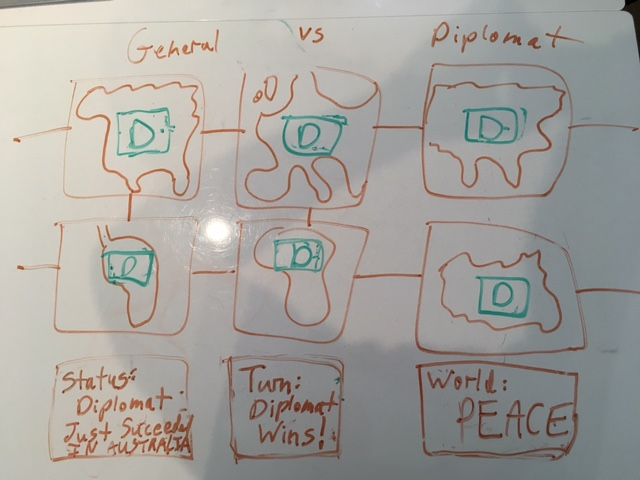

# General Versus Diplomat

## What is 'General Versus Diplomat'?

General Versus Diplomat' is a turn-based game between 2 players, a 'General' and a 'Diplomat'. 

The game board includes 6 continents: (top row) North America, Europe, Asia; and (bottom row)  South America, Africa, Australia. To the right of the continents are 2 boxes: "Turn" and "Status".

The game begins with a short introduction to the game. Before starting the game, the players can click on a 'rules' button to read a more technical description of the rules of the game.

Next, the General and Diplomat alternate in choosing their continents. Each player will control 3 continents at the start.

After the continents are selected, the game play begins. The General 'attacks' a continent each turn. The Diplomat 'negotiates' with a continent for each turn. A player can attack or negotiate with any continent, regardless of location. There is a 50% chance of success. Success means that the player now controls a new continent. Skipping turns is not allowed. 

The "Turn" box declares whose turn it is. The "Status" box tells whether the last player's move succeeded or failed.

A player wins by controlling all 6 continents. If the General controls all of the continents, the world will be at war. If the Diplomat controls all of the continents, the world will be at peace.

I chose to make this game because I have always enjoyed world-domination-themed games, such as Risk and Civilization. The theme itself adds to the enjoyment of the game, even if the game-play is relatively simple.

The game is deployed here: http://general-vs-diplomat.bitballoon.com/

## Technical Discussion

The game utilizes the following technologies:
* HTML (general framework for the game board)
* CSS (style, animations, adaptive design for web browser width)
* JavaScript (functions for the game logic, randomizer to choose first player and decide turn winner, manipulating the DOM to change the game board, create sound effects)

### Notes on Game Structure

In terms of game structure, the game is broken down into 3 parts: (1) introduction; (2) continent-selection; and (3) game play. The introduction phase offers the opportunity to read text about the rules of the game. Second, the continent selection process begins with a randomly selected player. The players alternate selecting 3 continents each. Third, game play commences, with each player clicking on an opposing player's continent to try to take it. Each click causes a 50/50 randomizer functiont to determine whether the turn is a win or not. When one player has all 6 continents, the game is over. At that point, the players can click a 'reset' button to play again.

### Sample Code

Here is the JavaScript code for determining who gets the first move in the game:

    function randomPlayer() {

      var randNum = Math.floor(Math.random() * 2);

      if (randNum === 0) {
        playerTurn = "General";
      } else {
        playerTurn = "Diplomat";
      }
    };

### Challenges

In terms of challenges, in the JavaScript, DOM manipulation is used to replace the introduction text with the rules of the game. Initially, the typewriter effect did not display for the rules. However, I overcame that challenge by using DOM manipulation to completely remove the introduction (including its HTML tags), creating a new 'div' tag for the rules section, with the 'announceTitle' and 'announceText' classes so that the CSS animations are called again when the rules text appears.

## The Making of 'General Versus Diplomat'

I made this game over a 5-day period and enjoyed every minute of it.

Before creating the game, I began by making several wire-frames for this project:

### Wireframes

Original wireframe for the beginning of the game:

Original wireframe for game play: 

Original wireframe for end of the game:

### From Concept to Playable Game

Turning the game from a concept into a playable game was a lot of fun!

While creating the game, I adjusted the game board by deleting the 'world' box and moving the 'turn' and 'status' boxes to the right side of the board. I also decided to hide the board during the introduction to make the player focus on the introduction and rules before starting. In terms of the game-play experience, I mosty implemented my original plan - however, I decided to use audio effects (not visual effects) to signal wins and failures.

Thanks to the following for providing their comments along the way: Jonathan Ahrens, John Bell, Alex Calleia, J Silverstein, and Phil Zak.

## Opportunities for Future Growth

In the future, I plan to: (a) add a strategic element to the game play so that a player must devise a strategy to increase the chances of winning; (b) make a 1-player version of the game.
